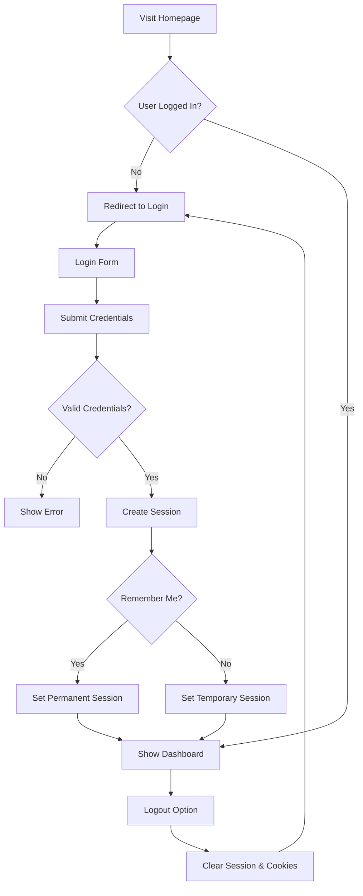

Check out the configuration reference at https://huggingface.co/docs/hub/spaces-config-reference

---

# Flask Login System 🔐

A simple yet comprehensive Flask-based user authentication system with SQLite database integration, featuring user registration, login, session management, and "Remember Me" functionality.

**Live Demo:** [https://lovnishverma-flask-login.hf.space/](https://lovnishverma-flask-login.hf.space/)

## 📋 Table of Contents

- [Features](#features)
- [Technologies Used](#technologies-used)
- [Installation](#installation)
- [Usage](#usage)
- [Project Structure](#project-structure)
- [API Routes](#api-routes)
- [Database Schema](#database-schema)
- [Security Considerations](#security-considerations)
- [Contributing](#contributing)
- [License](#license)

## ✨ Features

- **User Registration**: Create new user accounts with unique usernames
- **User Authentication**: Secure login system with credential verification
- **Session Management**: Server-side session handling for user state
- **Remember Me**: Optional persistent login that survives browser restarts
- **Cookie Management**: Last visit tracking with customizable expiration
- **SQLite Integration**: Lightweight database for user storage
- **Responsive Design**: Clean, user-friendly interface
- **Error Handling**: Proper validation and error messages

## 🛠️ Technologies Used

- **Backend**: Python 3.x, Flask
- **Database**: SQLite3
- **Frontend**: HTML, CSS (Bootstrap-compatible)
- **Session Management**: Flask Sessions
- **Deployment**: Hugging Face Spaces

## 📦 Installation

### Prerequisites

- Python 3.7 or higher
- pip (Python package installer)

### Local Setup

1. **Clone the repository**
   ```bash
   git clone https://github.com/yourusername/flask-login-system.git
   cd flask-login-system
   ```

2. **Install dependencies**
   ```bash
   pip install flask
   ```

3. **Run the application**
   ```bash
   python app.py
   ```

4. **Access the application**
   - Open your browser and navigate to `http://localhost:5000`

### Docker Setup (for Hugging Face Spaces)

The project includes Docker configuration for deployment on Hugging Face Spaces:

```dockerfile
FROM python:3.9-slim

WORKDIR /app

COPY requirements.txt .
RUN pip install -r requirements.txt

COPY . .

EXPOSE 7860

CMD ["python", "app.py"]
```

## 🎯 Usage

### Getting Started

1. **Access the Application**: Navigate to the home URL
2. **Create Account**: Click "Sign Up" to create a new user account
3. **Login**: Use your credentials to log in
4. **Remember Me**: Check the "Remember Me" option to stay logged in
5. **Logout**: Click "Logout" to end your session

### User Flow



## 📁 Project Structure

```
flask-login-system/
├── app.py                 # Main Flask application
├── templates/            # HTML templates
│   ├── base.html        # Base template
│   ├── login.html       # Login page
│   ├── signup.html      # Registration page
│   └── home.html        # Dashboard/home page
├── static/              # Static files (CSS, JS, images)
│   └── style.css       # Custom styles
├── users.db            # SQLite database (created automatically)
├── requirements.txt    # Python dependencies
├── Dockerfile         # Docker configuration
├── README.md          # Project documentation
└── .gitignore         # Git ignore rules
```

## 🛣️ API Routes

### Public Routes

| Route | Method | Description | Parameters |
|-------|---------|-------------|------------|
| `/login` | GET, POST | User login page | `username`, `password`, `remember` |
| `/signup` | GET, POST | User registration | `username`, `password` |

### Protected Routes

| Route | Method | Description | Authentication Required |
|-------|---------|-------------|------------------------|
| `/` | GET | Homepage/Dashboard | Yes |
| `/logout` | GET | User logout | Yes |

### Route Details

#### `/` (Homepage)
- **Method**: GET
- **Authentication**: Required
- **Description**: Main dashboard showing welcome message and last visit info
- **Response**: Redirects to login if not authenticated

#### `/signup` (Registration)
- **Methods**: GET, POST
- **Parameters**: 
  - `username` (string): Unique username
  - `password` (string): User password
- **Validation**: Username must be unique
- **Response**: Redirects to login on success

#### `/login` (Authentication)
- **Methods**: GET, POST
- **Parameters**:
  - `username` (string): User's username
  - `password` (string): User's password  
  - `remember` (checkbox): Optional "Remember Me"
- **Response**: Redirects to homepage on success

#### `/logout` (Session Termination)
- **Method**: GET
- **Description**: Clears session and cookies
- **Response**: Redirects to login page

## 🗄️ Database Schema

### Users Table

```sql
CREATE TABLE users (
    id INTEGER PRIMARY KEY AUTOINCREMENT,
    username TEXT UNIQUE NOT NULL,
    password TEXT NOT NULL
);
```

| Column | Type | Constraints | Description |
|--------|------|-------------|-------------|
| `id` | INTEGER | PRIMARY KEY, AUTOINCREMENT | Unique user identifier |
| `username` | TEXT | UNIQUE, NOT NULL | User's login name |
| `password` | TEXT | NOT NULL | User's password (plain text) |

### Database Operations

- **Connection**: SQLite3 with `sqlite3.Row` factory for dictionary-like access
- **Initialization**: Automatic table creation on first run
- **Queries**: Parameterized queries to prevent SQL injection

## 🔒 Security Considerations

### Current Implementation

- ✅ SQL injection protection via parameterized queries
- ✅ Session-based authentication
- ✅ CSRF protection through Flask's secret key
- ✅ Input validation and error handling

### Production Recommendations

- ⚠️ **Password Hashing**: Currently stores plain text passwords
  ```python
  from werkzeug.security import generate_password_hash, check_password_hash
  
  # For registration
  hashed_password = generate_password_hash(password)
  
  # For login verification
  check_password_hash(stored_hash, provided_password)
  ```

- ⚠️ **Environment Variables**: Move secret key to environment variables
  ```python
  import os
  app.secret_key = os.environ.get('SECRET_KEY', 'fallback-secret-key')
  ```

- ⚠️ **HTTPS**: Enable HTTPS in production
- ⚠️ **Rate Limiting**: Implement login attempt limits
- ⚠️ **Input Validation**: Add comprehensive input sanitization
- ⚠️ **Session Security**: Configure secure session cookies

### Recommended Security Enhancements

```python
# Enhanced security configuration
app.config.update(
    SESSION_COOKIE_SECURE=True,      # HTTPS only
    SESSION_COOKIE_HTTPONLY=True,    # No JS access
    SESSION_COOKIE_SAMESITE='Lax',   # CSRF protection
    PERMANENT_SESSION_LIFETIME=timedelta(hours=1)  # Shorter sessions
)
```

## 🎨 Frontend Templates

### Template Structure

All templates extend `base.html` for consistent styling:

```html
<!-- base.html -->
<!DOCTYPE html>
<html lang="en">
<head>
    <meta charset="UTF-8">
    <meta name="viewport" content="width=device-width, initial-scale=1.0">
    <title>Flask Login System</title>
    <link href="https://cdn.jsdelivr.net/npm/bootstrap@5.1.3/dist/css/bootstrap.min.css" rel="stylesheet">
</head>
<body>
    <div class="container mt-4">
        
    </div>
</body>
</html>
```

### Form Examples

#### Login Form
```html
<form method="POST">
    <div class="mb-3">
        <label for="username" class="form-label">Username</label>
        <input type="text" class="form-control" name="username" required>
    </div>
    <div class="mb-3">
        <label for="password" class="form-label">Password</label>
        <input type="password" class="form-control" name="password" required>
    </div>
    <div class="mb-3 form-check">
        <input type="checkbox" class="form-check-input" name="remember">
        <label class="form-check-label">Remember Me</label>
    </div>
    <button type="submit" class="btn btn-primary">Login</button>
</form>
```

## 🚀 Deployment

### Hugging Face Spaces

The project is configured for deployment on Hugging Face Spaces:

1. **Create Space**: Create a new Space on Hugging Face
2. **Upload Files**: Push your code to the Space repository
3. **Configuration**: Ensure `app.py` runs on port 7860
4. **Environment**: The Space will automatically build and deploy

### Local Development

```bash
# Development mode with auto-reload
export FLASK_ENV=development
export FLASK_DEBUG=1
python app.py
```

### Production Deployment

```bash
# Use a production WSGI server
pip install gunicorn
gunicorn -w 4 -b 0.0.0.0:5000 app:app
```

## 🤝 Contributing

1. Fork the repository
2. Create a feature branch (`git checkout -b feature/amazing-feature`)
3. Commit your changes (`git commit -m 'Add amazing feature'`)
4. Push to the branch (`git push origin feature/amazing-feature`)
5. Open a Pull Request

### Development Guidelines

- Follow PEP 8 style guidelines
- Add comments for complex logic
- Update documentation for new features
- Test all functionality before submitting

## 📝 License

This project is licensed under the MIT License - see the [LICENSE](LICENSE) file for details.

## 🐛 Known Issues

- Plain text password storage (security concern)
- No password strength validation
- No account recovery mechanism
- Limited input sanitization

## 🔮 Future Enhancements

- [ ] Password hashing with bcrypt/scrypt
- [ ] Email verification system
- [ ] Password reset functionality
- [ ] User profile management
- [ ] Role-based access control
- [ ] OAuth integration (Google, GitHub)
- [ ] Rate limiting and brute force protection
- [ ] Advanced session management
- [ ] API endpoints for mobile apps
- [ ] Unit and integration tests

## 📞 Support

For questions, issues, or contributions:

- **Repository**: [GitHub Repository](https://github.com/lovnishverma/flask-login-system)
- **Live Demo**: [Flask Login System](https://lovnishverma-flask-login.hf.space/)
- **Issues**: Use GitHub Issues for bug reports and feature requests

---

**Note**: This is a demonstration project for educational purposes. For production use, implement proper security measures including password hashing, HTTPS, and comprehensive input validation.